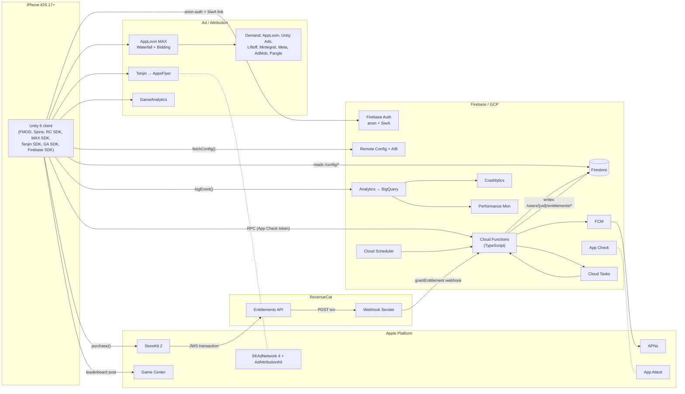

# Technical Architecture & Data Schemas — Lucent: Shards of the Shattered Sun

**Status:** Engineer-ready spec. Anyone joining the team should be able to wire up the backend from this doc + the linked decision docs.
**Stack source-of-truth:** `design/02-tech-stack-decision.md`.
**Economy source-of-truth:** `design/04-progression-and-economy.md`.
**Scope source-of-truth:** `design/05-launch-scope.md`.

> All identifiers, field names, and function signatures in this doc are normative — please don't drift them silently. If you need to rename, open a PR against this file first.

---

## 1. System Architecture

The runtime is a Unity 6 iOS client talking to three logical backends in parallel:

1. **Firebase** is the system of record for player state, server logic, LiveOps, push, and observability.
2. **RevenueCat** is the system of record for entitlements (subscriptions and one-time products), sitting in front of StoreKit 2. It pushes purchase events to a Cloud Function webhook that grants in-game currency/items.
3. **AppLovin MAX** mediates rewarded video; **Tenjin** (later AppsFlyer) sees the install + IAP events for attribution; **GameAnalytics** sees the same events for game-design dashboards.



### 1.1 First-launch data flow (canonical sequence)

1. **App boot** → silent anonymous Firebase Auth → UID minted. App Check token requested via App Attest.
2. **Client `/sessionStart`** Cloud Function call: writes `lastLoginAt`, returns Remote Config snapshot + server time + feature flags.
3. **Silent Game Center sign-in attempt** — stores `teamPlayerID` on `/users/{uid}/profile.gameCenterId`. No UI shown.
4. **First gameplay run** → `startRun` returns `{runId, seed, hmacKey}` → on completion, `endRun` validates HMAC, applies rewards.
5. **First IAP intent** → prompt **Sign in with Apple**, call Firebase `linkWithCredential`. UID is preserved across devices.
6. **Purchase** flows through StoreKit 2 → RevenueCat → `RCWebhook` → `grantEntitlement` Cloud Function → `/users/{uid}/entitlements/{productId}` + currency credit in `/users/{uid}`.
7. **Tenjin** sees the install + first-purchase event; **GameAnalytics** sees the same; **SKAN/AAK** postbacks fire on Apple's schedule.

---

## 2. Firestore Data Model

### 2.1 Conventions

- All timestamps are **Firestore Timestamps** (UTC); UI converts to player local.
- All currency fields are **non-negative integers** (no floats anywhere in the economy). Float fields exist only in run telemetry (DPS, duration).
- All IDs are **lowercase kebab-case** (`hero-dawnbow`, `gear-weapon-bow`, `sigil-fire-ember`).
- All write paths into player subtrees go through Cloud Functions; security rules deny direct client writes (see §3).
- Subcollections sit under `/users/{uid}` for tenant isolation — never embed unbounded arrays on the root doc.

### 2.2 Root: `/users/{uid}`

The primary player document. Held in memory client-side after auth; refreshed every 5 min and after any successful RPC return value containing a `userPatch`.

```typescript
interface UserDoc {
  // identity
  uid: string;                         // Firebase Auth UID (matches doc id)
  displayName: string;                 // 3-16 chars, profanity-filtered server-side
  avatarId: string;                    // references /config/avatars/{id}
  country: string;                     // ISO-3166-1 alpha-2, from auth metadata
  langs: string[];                     // preferred locales, ordered
  gameCenterId?: string;               // GKLocalPlayer.teamPlayerID, opaque
  appleSignInLinked: boolean;          // false while still anon
  createdAt: Timestamp;
  installVersion: string;              // semver of first-install client
  clientVersion: string;               // semver of last seen client

  // account progression
  accountLevel: number;                // 1..100 launch
  accountXP: number;

  // currencies (see design/04 §1)
  gold: number;
  gems: number;
  embers: number;
  sigilDust: number;
  lucentShards: number;
  passPoints: number;

  // energy
  energy: number;                      // 0..energyMaxOverflow (60 with overflow)
  energyRegenStartedAt: Timestamp;     // last time energy was below cap

  // session bookkeeping
  lastLoginAt: Timestamp;
  dailyResetAt: Timestamp;              // next 09:00 in user's tz
  weeklyResetAt: Timestamp;             // next Monday 09:00 in user's tz
  tzOffsetMinutes: number;              // resolved client-side, cached server-side

  // entitlements & flags
  entitlementIds: string[];            // mirrored from RevenueCat ("monthly_card", "battle_pass_s3_premium")
  featureFlags: Record<string, boolean>; // server-overridable kill-switches
  cohortIds: string[];                 // Firebase Audience names for analytics joins

  // anti-cheat
  trustScore: number;                  // 0..1, decays with anomalies
  shadowBanned: boolean;
}
```

**Document size budget:** ~1.5 KB hot. Hard rule: no array on this doc grows past 32 entries (cohorts, entitlements, flags).

### 2.3 Per-hero state: `/users/{uid}/heroes/{heroId}`

One doc per owned hero. `heroId` references `/config/heroes/{heroId}`.

```typescript
interface HeroDoc {
  heroId: string;
  level: number;                       // 1..80 at launch
  xp: number;
  masteryPoints: number;               // unlocked at L20/40/60/80
  masteryAllocations: Record<string, number>; // {"nodeId": pointsSpent}
  ascensionStars: number;              // 0..6
  ascensionShards: number;             // hero-specific shard balance
  equippedGear: [string|null, string|null, string|null,
                 string|null, string|null, string|null]; // 6 slots, itemIds
  equippedSigils: [string|null, string|null, string|null]; // 3 slots
  equippedSpirit: string | null;
  unlockedAt: Timestamp;
  lastPlayedAt: Timestamp;
}
```

### 2.4 Gear inventory: `/users/{uid}/inventory/gear/{itemId}`

```typescript
interface GearItemDoc {
  itemId: string;                      // server-generated UUID
  slot: "weapon"|"helm"|"armor"|"ring"|"locket"|"bracelet";
  baseType: string;                    // refs /config/gear/{baseType}
  setId?: string;                      // refs /config/sets/{setId}
  rarity: "common"|"rare"|"epic"|"legendary"|"mythic"|"chaos";
  level: number;                       // 1..20 within rarity tier
  affixes: Affix[];                    // length depends on rarity
  lockedAffixes: number[];             // indices into affixes[], 0..2 locked for reroll-protection
  acquiredAt: Timestamp;
  seed: number;                        // server-rolled, deterministic affix generation
  source: "drop"|"craft"|"shop"|"event"|"mail";
}

interface Affix {
  id: string;                          // refs /config/affixes/{id}
  tier: number;                        // 1..6 affix quality
  value: number;                       // resolved stat magnitude
  isPrimary: boolean;
}
```

**Sharding note:** with 8 heroes × 6 slots × on average 4 unequipped duplicates per slot, expected gear doc count per player at endgame ~200–600. Well within Firestore's per-subcollection performance.

### 2.5 Sigils: `/users/{uid}/inventory/sigils/{itemId}`

```typescript
interface SigilDoc {
  itemId: string;
  category: "fire"|"frost"|"storm"|"void"; // 4 categories per design/04 §2
  rarity: "common"|"rare"|"epic"|"legendary"|"mythic"|"chaos";
  affix: string;                       // refs /config/sigilAffixes/{id}
  level: number;                       // 1..20
  enchanted: boolean;                  // true after first enchant
  enchantSeed?: number;                // server-rolled
  acquiredAt: Timestamp;
}
```

### 2.6 Spirits: `/users/{uid}/inventory/spirits/{spiritId}`

```typescript
interface SpiritDoc {
  spiritId: string;                    // refs /config/spirits/{id}
  level: number;
  ascensionStars: number;              // 0..6
  obtained: Timestamp;
}
```

### 2.7 Inscription (talent grid): `/users/{uid}/inscription/{nodeId}`

5×4 grid → 20 nodes. One doc per node only when level > 0; absence = level 0.

```typescript
interface InscriptionNodeDoc {
  nodeId: string;                      // "row2-col3" coordinate refs /config/inscription/{nodeId}
  level: number;                       // 1..20
  updatedAt: Timestamp;
}
```

### 2.8 Quests: `/users/{uid}/quests/daily/{questId}` and `/quests/weekly/{questId}`

Identical shape; lifecycle differs (daily resets at 09:00 local, weekly Monday 09:00).

```typescript
interface QuestDoc {
  questId: string;                     // refs /config/quests/{questId}
  progress: number;
  target: number;
  claimedAt?: Timestamp;
  expiresAt: Timestamp;                // hard expiry (server enforces on claim)
  rewardPreview: RewardBundle;         // snapshot of reward at issue time
}
```

### 2.9 Battle pass: `/users/{uid}/battlePass/{seasonId}`

```typescript
interface BattlePassDoc {
  seasonId: string;                    // e.g. "s3-fall-2026"
  tier: number;                        // 0..100
  xp: number;                          // pass points accumulated this season
  track: "free"|"premium"|"hero";      // hero = "buy a hero" SKU
  claimedTiers: number[];              // sorted ascending, per track
  claimedTiersByTrack: Record<"free"|"premium"|"hero", number[]>;
  startedAt: Timestamp;
  endsAt: Timestamp;
}
```

### 2.10 Mailbox: `/users/{uid}/mailbox/{mailId}`

```typescript
interface MailDoc {
  mailId: string;
  senderType: "system"|"admin"|"event"|"guild"|"player"|"refund";
  senderName: string;
  subject: string;                     // localized at send time, plain text
  body: string;                        // markdown-lite, ≤2KB
  attachments: RewardBundle | null;
  sentAt: Timestamp;
  expiresAt: Timestamp;                // typically +30d
  claimedAt?: Timestamp;
  readAt?: Timestamp;
}

interface RewardBundle {
  currencies?: Partial<Record<"gold"|"gems"|"embers"|"sigilDust"|"lucentShards"|"passPoints", number>>;
  items?: { baseType: string; rarity: string; count: number; }[];
  heroes?: { heroId: string; shards: number; }[];
  energy?: number;
}
```

### 2.11 Runs: `/users/{uid}/runs/{runId}`

A capped-history summary collection (most recent 50 retained; older purged by `runRetentionJob`).

```typescript
interface RunDoc {
  runId: string;                       // UUIDv4 minted by startRun
  mode: "campaign"|"tower"|"survival"|"daily";
  chapter?: number;
  floor?: number;
  hero: string;
  result: "victory"|"defeat"|"abandon";
  seed: string;                        // 128-bit hex, server-generated
  startedAt: Timestamp;
  endedAt: Timestamp;
  duration: number;                    // ms
  damageDealt: number;
  damageTaken: number;
  kills: number;
  goldEarned: number;
  embersEarned: number;
  drops: { baseType: string; rarity: string; }[];
  serverSignature: string;             // HMAC computed by endRun, archived for audit
  anomalies: string[];                 // e.g. ["dps-spike","duration-too-short"]; empty for clean runs
}
```

### 2.12 Entitlements: `/users/{uid}/entitlements/{productId}`

Mirror of RevenueCat state for fast in-app reads (we never ping RC from the client).

```typescript
interface EntitlementDoc {
  productId: string;                   // App Store product id ("monthly_card")
  rcEntitlementId: string;             // RC "monthly_card_active"
  provider: "revenuecat";
  purchasedAt: Timestamp;
  expiresAt?: Timestamp;               // null for non-consumables; populated for subs
  willRenew: boolean;
  isInTrial: boolean;
  isSandbox: boolean;
  txId: string;                        // App Store originalTransactionId
  lastWebhookAt: Timestamp;
}
```

### 2.13 Audit log: `/users/{uid}/audit/{eventId}`

Idempotency record for every grant. `eventId` is the correlationId from the grant request — duplicate writes are no-ops.

```typescript
interface AuditDoc {
  eventId: string;                     // correlation id from caller
  correlationId: string;               // == eventId, kept for cross-ref
  grantType: "iap"|"run"|"mail"|"quest"|"gacha"|"event"|"admin"|"refund";
  amount: RewardBundle;
  appliedAt: Timestamp;
  serverFn: string;                    // function name that wrote this
  txRef?: string;                      // e.g. RC transaction id, runId
  notes?: string;                      // human-readable, used by support tools
}
```

**Retention:** 90 days for `run`/`quest`/`mail` audits; 7 years for `iap`/`refund` (financial). Lifecycle job moves old `iap` audits to BigQuery for cold storage.

### 2.14 Shared (non-user) collections

#### `/config/serverConfig` (single doc)

The single source of truth for tunables on the server side. Mirrored to Remote Config so the client can read them too — Firestore wins on conflict. Updated by an admin function `publishServerConfig`.

```typescript
interface ServerConfigDoc {
  version: string;                     // semver, advances on every publish
  publishedAt: Timestamp;
  publishedBy: string;
  energy: {
    cap: number;                       // 30
    overflowCap: number;               // 60
    regenSeconds: number;              // 720 (12 min)
    refillAdReward: number;            // 5
    refillAdDailyCap: number;          // 4
    refillGemCost: number;             // 50 → +30
  };
  gachaRates: Record<string, Record<string, number>>;  // bannerId → rarity → probability
  pity: { soft: number; hard: number; mythicCarryRate: number; };
  dropTables: Record<string, DropTable>;
  abilityWeights: Record<string, Record<string, number>>; // chapter → ability → weight
  ratesLimits: { runsPerMin: number; gachaPullsPerHour: number; iapGrantsPerHour: number; };
  killSwitches: Record<string, boolean>; // emergencyDisableGacha, freezeIAPGrants, etc.
}
```

#### `/config/abilities/{abilityId}`, `/config/heroes/{heroId}`, `/config/gear/{baseType}`, `/config/sigilAffixes/{id}`, `/config/affixes/{id}`, `/config/sets/{setId}`, `/config/spirits/{id}`, `/config/inscription/{nodeId}`, `/config/quests/{questId}`, `/config/avatars/{id}`

Read-only catalog docs. Mirrored from the design repo via a CI job (`pushCatalogToFirestore` on merge to main of `/content/*.md`).

#### `/leaderboards/{boardId}/entries/{uid}`

Sharded leaderboard rows. `boardId` = `"tower-global"|"tower-weekly"|"pvp-season-3"|...`.

```typescript
interface LeaderboardEntry {
  uid: string;
  displayName: string;                 // denormalized for fast read
  avatarId: string;                    // denormalized
  score: number;
  rank?: number;                       // recomputed every 5 min by leaderboard rollup
  shardKey: number;                    // 0..63 sharded write key for hot-doc avoidance
  updatedAt: Timestamp;
}
```

Per the Firebase leaderboard pattern, writes hit `/leaderboards/{boardId}/shards/{0..63}/entries/{uid}`; reads union the shards. `recomputeLeaderboardRanks` runs every 5 min.

#### `/guilds/{guildId}`

```typescript
interface GuildDoc {
  guildId: string;
  name: string;                        // unique, profanity-filtered
  motto: string;
  ownerUid: string;
  officerUids: string[];               // max 4
  memberUids: string[];                // max 30 at launch
  memberCount: number;                 // denormalized counter
  isOpen: boolean;
  minAccountLevel: number;
  totalDonationsWeekly: number;
  weeklyBossState: {
    bossId: string;
    hpRemaining: number;
    contributors: Record<string, number>; // uid → damage contributed this week
    resetAt: Timestamp;
  };
  createdAt: Timestamp;
}
```

#### `/guilds/{guildId}/chat/{messageId}`

Append-only chat. Capped: oldest 200 retained; rolling purge.

```typescript
interface GuildChatMessage {
  messageId: string;
  uid: string;
  displayName: string;
  text: string;                        // ≤200 chars, profanity-filtered
  sentAt: Timestamp;
}
```

#### `/events/{eventId}`

```typescript
interface EventDoc {
  eventId: string;
  type: "tournament"|"milestone"|"bossRush"|"doubleDrops"|"limited";
  startsAt: Timestamp;
  endsAt: Timestamp;
  state: "scheduled"|"active"|"grace"|"settled";
  milestones: { threshold: number; reward: RewardBundle; }[];
  leaderboardId?: string;              // present for tournament type
  config: Record<string, unknown>;     // per-event JSON (e.g. event currency, banners)
  participantsCount: number;           // denormalized counter
}
```

### 2.15 Collection inventory summary

Player subtree (12 collections): `users`, `users/{}/heroes`, `users/{}/inventory/gear`, `users/{}/inventory/sigils`, `users/{}/inventory/spirits`, `users/{}/inscription`, `users/{}/quests/daily`, `users/{}/quests/weekly`, `users/{}/battlePass`, `users/{}/mailbox`, `users/{}/runs`, `users/{}/entitlements`, `users/{}/audit`. **13 player-scoped collections** total.

Shared (8 collection groups): `config/serverConfig` (singleton), `config/abilities`, `config/heroes`, `config/gear`, `config/sigilAffixes`/`affixes`/`sets`/`spirits`/`inscription`/`quests`/`avatars` (catalog), `leaderboards/{}/entries`, `guilds`, `guilds/{}/chat`, `events`. **8 shared collection roots** (with catalog rolled up as one).

**Total launch collection count: 21** (13 player-scoped + 8 shared/catalog).

---

## 3. Security Rules

The rules below are illustrative; real `firestore.rules` will live in `infra/firestore.rules`.

```javascript
rules_version = '2';
service cloud.firestore {
  match /databases/{database}/documents {

    // --- Catalog: client-read, no-client-write ---
    match /config/{document=**} {
      allow read: if request.auth != null;
      allow write: if false;             // only admin SDK via Cloud Functions
    }

    // --- Player subtree: read-own, write-via-function ---
    match /users/{uid} {
      allow read: if request.auth != null && request.auth.uid == uid;
      allow write: if false;             // all writes go through Cloud Functions
    }
    match /users/{uid}/{collection}/{doc=**} {
      allow read: if request.auth != null && request.auth.uid == uid;
      allow write: if false;
    }

    // --- Leaderboards: read all, no client writes ---
    match /leaderboards/{board}/{document=**} {
      allow read: if request.auth != null;
      allow write: if false;
    }

    // --- Guilds: members read; chat writeable by members ---
    match /guilds/{gid} {
      allow read: if request.auth != null
        && (resource.data.isOpen == true
            || request.auth.uid in resource.data.memberUids);
      allow write: if false;             // joinGuild / donateToGuild functions only
    }
    match /guilds/{gid}/chat/{messageId} {
      allow read: if request.auth != null
        && request.auth.uid in get(/databases/$(database)/documents/guilds/$(gid)).data.memberUids;
      allow create: if request.auth != null
        && request.auth.uid in get(/databases/$(database)/documents/guilds/$(gid)).data.memberUids
        && request.resource.data.uid == request.auth.uid
        && request.resource.data.text.size() <= 200;
      allow update, delete: if false;
    }

    // --- Events: read-only for clients ---
    match /events/{eventId} {
      allow read: if request.auth != null;
      allow write: if false;
    }
  }
}
```

**Security model in one sentence:** *Clients read their own subtree + catalogs + leaderboards + their guild + active events; every write of consequence is gated by App Check + Cloud Function authentication.*

---

## 4. Cloud Functions Inventory

All functions are TypeScript on the Cloud Functions for Firebase v2 runtime (`onCall` HTTPS or `onSchedule`). Every callable enforces:

- App Check token verification (rejects if missing/invalid).
- `context.auth.uid` present (rejects anon-less calls).
- Per-uid rate limit (Redis-free, Firestore counter doc per minute window — replaced with Memorystore at 100k MAU).
- Correlation id (caller-provided or server-minted) for idempotency via `/users/{uid}/audit/{eventId}`.

| Function | Trigger | Signature | Idempotency | Expected QPS at 100k MAU | Touches |
|---|---|---|---|---|---|
| `sessionStart` | onCall | `(deviceMeta) → {serverTime, configVersion, userPatch}` | none (read-mostly; `lastLoginAt` set is fine to dup) | ~12 (sessions/day / 86400) | `/users/{uid}` |
| `startRun` | onCall | `(mode, hero, chapter?) → {runId, seed, hmacKey}` | runId is fresh per call; no dedupe needed | ~80 | `/users/{uid}/runs/{runId}` (write), `/users/{uid}` (energy debit) |
| `endRun` | onCall | `(runId, summary, hmac) → {rewards}` | `runId` is idempotency key; second call returns cached rewards from audit | ~80 | `/users/{uid}` (currencies), `/users/{uid}/inventory/gear/*`, `/users/{uid}/runs/{runId}`, `/users/{uid}/audit/{runId}` |
| `gachaPull` | onCall | `(bannerId, pulls: 1|10) → {results, newPity}` | correlationId per intent; reject duplicates within 5 s | ~10 | `/users/{uid}` (gem debit, shards/heroes credit), `/users/{uid}/heroes/*` |
| `grantEntitlement` | onCall (webhook from RevenueCat) | `(rcEventBody) → 200` | RC `transaction_id` is key | ~3 | `/users/{uid}/entitlements/{productId}`, `/users/{uid}` currency, `/users/{uid}/audit/{txId}` |
| `restoreEntitlements` | onCall | `() → {entitlementIds}` | safe to call repeatedly | ~1 | `/users/{uid}/entitlements/*` |
| `claimMail` | onCall | `(mailId) → {rewards}` | `mailId` is idempotency key (claimedAt set in audit) | ~6 | `/users/{uid}/mailbox/{mailId}`, `/users/{uid}` |
| `claimQuest` | onCall | `(questId, scope: "daily"\|"weekly") → {rewards}` | `questId+resetCycle` | ~10 | `/users/{uid}/quests/{scope}/{questId}`, `/users/{uid}` |
| `claimBattlePassTier` | onCall | `(seasonId, tier, track) → {rewards}` | `seasonId+tier+track` | ~4 | `/users/{uid}/battlePass/{seasonId}` |
| `tradeShards` | onCall | `(heroId, n) → {heroLevel?, ascensionStars?}` | correlationId | ~1 | `/users/{uid}/heroes/{heroId}`, `/users/{uid}` |
| `purchaseInRunItem` | onCall | `(runId, shopItemId) → {applied}` | `runId+shopItemId` | ~5 | `/users/{uid}` (gold debit) — does NOT write to long-term inventory; effect lives in run state |
| `equipGear` | onCall | `(heroId, slot, itemId\|null) → {hero}` | last-write-wins (no audit needed) | ~3 | `/users/{uid}/heroes/{heroId}` |
| `salvageGear` | onCall | `(itemIds[]) → {embersGained}` | correlationId | ~2 | `/users/{uid}/inventory/gear/*`, `/users/{uid}` |
| `upgradeGear` | onCall | `(itemId) → {newLevel}` | correlationId | ~3 | `/users/{uid}/inventory/gear/{itemId}`, `/users/{uid}` |
| `upgradeInscription` | onCall | `(nodeId) → {newLevel}` | correlationId | ~1 | `/users/{uid}/inscription/{nodeId}`, `/users/{uid}` |
| `applySigilEnchant` | onCall | `(sigilId) → {sigil}` | correlationId | ~1 | `/users/{uid}/inventory/sigils/{sigilId}`, `/users/{uid}` |
| `joinGuild` | onCall | `(guildId) → {guild}` | one-active-guild invariant enforced via transaction | ~0.3 | `/guilds/{guildId}`, `/users/{uid}` |
| `leaveGuild` | onCall | `() → {ok}` | trivial | ~0.05 | `/guilds/{guildId}`, `/users/{uid}` |
| `donateToGuild` | onCall | `(amount) → {ok}` | correlationId | ~1 | `/guilds/{guildId}`, `/users/{uid}` |
| `damageGuildBoss` | onCall | `(damageEvents, hmac) → {hpRemaining, contribution}` | runId of associated run | ~0.5 | `/guilds/{guildId}` (sharded write to `/guilds/{}/bossShards/{0..15}`) |
| `submitPvpReplay` | onCall | `(replayBlob, seed, hmac) → {rank, score}` | replay id | ~1 | `/leaderboards/pvp-current/entries/{uid}` |
| `setLanguage` | onCall | `(lang) → {ok}` | safe to dup | ~0.1 | `/users/{uid}` |
| `linkAppleId` | onCall | `(appleCredential) → {linked}` | safe to dup | ~0.1 | Firebase Auth + `/users/{uid}` |
| `reportPlayer` | onCall | `(targetUid, reasonCode, runId?) → {ticketId}` | per-reporter rate limited | ~0.05 | `/moderation/reports/*` |
| `rotateDailyReset` | scheduled (per-uid Cloud Task) | scheduled at user-local 09:00 | per-uid+date | one task per active user per day | `/users/{uid}/quests/daily/*` |
| `rotateWeeklyReset` | scheduled (per-uid Cloud Task) | Monday 09:00 user-local | per-uid+isoweek | one task per active user per week | `/users/{uid}/quests/weekly/*`, `/users/{uid}/battlePass/*` |
| `endBattlePassSeason` | onSchedule | midnight UTC end-of-season | per seasonId | once | mass mail send, season state archive |
| `eventStateMachine` | onSchedule (every minute) | walks `/events/*` rows in `scheduled/active/grace` | per (eventId, transition) | one row per minute | `/events/*` |
| `recomputeLeaderboardRanks` | onSchedule (5-min) | merges 64 shards per board | none (idempotent rollup) | per board | `/leaderboards/{}/entries/*` |
| `runRetentionJob` | onSchedule (daily) | trims `/users/{uid}/runs` to most-recent 50 | none | one pass | `/users/{uid}/runs/*` |
| `mailRetentionJob` | onSchedule (daily) | deletes expired mail with `claimedAt` set | none | one pass | `/users/{uid}/mailbox/*` |
| `auditColdStorageJob` | onSchedule (daily) | exports IAP audits > 90d to BigQuery cold table | none | one pass | `/users/{uid}/audit/*` |
| `publishServerConfig` | onCall (admin only) | `(configJson) → {version}` | semver bump enforced | rare | `/config/serverConfig`, Remote Config publish |
| `pushCatalogToFirestore` | GitHub Actions invocation | `(catalogTarball) → {countsByCollection}` | content-hash check | rare | `/config/*` |
| `adminGrant` | onCall (admin) | `(uid, rewards, reason) → {ok}` | correlationId | rare | `/users/{uid}`, `/users/{uid}/audit/{eventId}` |
| `adminFlagUser` | onCall (admin) | `(uid, flag) → {ok}` | last-write-wins | rare | `/users/{uid}` |
| `appleAssnWebhook` | HTTPS | App Store Server Notifications V2 ingress (refunds, etc.) | originalTransactionId | rare | `/users/{uid}/entitlements/*`, mail |

**Total Cloud Functions inventory: 38** (28 callable, 7 scheduled, 1 HTTPS webhook, 2 admin/CI).

### 4.1 Function call envelope

All `onCall` use a uniform request envelope, validated by a `zod` schema in `functions/src/schemas/`:

```typescript
interface CallEnvelope<P> {
  payload: P;                          // function-specific
  correlationId: string;               // UUIDv4; idempotency key
  clientVersion: string;               // semver, for kill-switch checks
  clientNow: number;                   // ms since epoch, for skew detection
}

interface CallResponse<R> {
  ok: boolean;
  result?: R;
  userPatch?: Partial<UserDoc>;        // delta to apply to cached user doc client-side
  error?: { code: string; message: string; retryable: boolean; };
}
```

The `userPatch` pattern keeps the client cache fresh without a separate refetch — it's the most important latency win in the design.

---

## 5. Server-Authoritative Run-Validation Protocol

The goal: make memory-edited or modified clients economically uninteresting without server-simulating every frame. We accept that the *simulation* is client-authoritative for latency reasons, but we deny the *economic record* unless the run plausibly happened.

### 5.1 Wire format

**Step 1 — `startRun` request:**

```typescript
// Client → server
{
  correlationId: "uuid-v4",
  payload: {
    mode: "campaign",
    hero: "hero-dawnbow",
    chapter: 3,
    floor: null,                       // tower only
    deviceTimezoneOffsetMin: -480,
    energySpendIntent: 6
  }
}
```

**Step 2 — `startRun` response:**

```typescript
{
  ok: true,
  result: {
    runId: "01HZ9X3F6KQVT5KQ8YWJG3X8AB",  // ULID
    seed: "9c1ef4a3...64hex",              // 128-bit hex; server-generated
    hmacKey: "base64-256bit-key",          // valid only for this runId, 30 min TTL
    expiresAt: 1715472000000,
    chapterConfig: {                       // snapshot of /config/* for this run
      dropTableVersion: "2026.05.11-1",
      maxEnemyCount: 412,
      maxAchievableScore: 18250,
      timeBoundsMs: { min: 35000, max: 1800000 }
    }
  },
  userPatch: { energy: 24 }                // energy debited immediately
}
```

The `seed` drives all client-side RNG (enemy spawns, loot rolls, ability offers). The client must use this seed deterministically — the server will refuse runs whose claimed drops are inconsistent with the seed + drop table.

**Step 3 — Client plays the run.** During the run, the client maintains a rolling hash of significant events:

```typescript
interface RunEventLog {
  uid: string;
  runId: string;
  seed: string;
  events: RunEvent[];                  // capped to ~200 entries; aggregated above that
}

type RunEvent =
  | { t: "spawn"; ms: number; enemyId: string; pos: [number, number]; }
  | { t: "damage_dealt"; ms: number; targetId: string; amount: number; abilityId: string; }
  | { t: "damage_taken"; ms: number; amount: number; sourceId: string; }
  | { t: "ability_pick"; ms: number; offered: string[]; chosen: string; }
  | { t: "drop_claimed"; ms: number; baseType: string; rarity: string; }
  | { t: "boss_phase"; ms: number; phase: number; bossId: string; };
```

**Step 4 — `endRun` request:**

```typescript
// Client → server
{
  correlationId: "<runId>",                // runId IS the idempotency key
  payload: {
    runId: "01HZ9X3F6KQVT5KQ8YWJG3X8AB",
    result: "victory",
    summary: {
      durationMs: 187432,
      kills: 287,
      damageDealt: 4_182_500,
      damageTaken: 12_400,
      peakDPS: 38200,
      goldEarned: 1240,
      embersEarned: 38,
      drops: [
        { baseType: "gear-bracelet-3", rarity: "epic" }
      ],
      abilityPicks: ["a-fireball", "a-ricochet", "a-quickfoot", "a-burn"],
      score: 14820
    },
    eventDigest: "blake3-hex-of-event-log"
  },
  hmac: "base64-of-HMAC-SHA256(hmacKey, canonical(payload))"
}
```

### 5.2 Server validation pipeline (`endRun`)

```
1. App Check token valid?                                       → 401 otherwise
2. context.auth.uid present?                                     → 401 otherwise
3. /users/{uid}/audit/{runId} exists?                            → return cached rewards (idempotent replay)
4. Open run record for runId exists & not expired?               → 409 otherwise
5. HMAC over canonical(payload) matches?                         → 403 otherwise (flag & log)
6. Sanity checks:
   a. duration in [chapterConfig.timeBoundsMs.min, .max]
   b. damageDealt / durationMs ≤ maxDPS(hero, build) × 1.5
   c. peakDPS ≤ theoreticalMaxDPS × 2
   d. damageTaken ≥ 0 (with invulnerability flag, ≥ 0; else ≥ minDamageForBoss(chapter))
   e. kills ≤ chapterConfig.maxEnemyCount × 1.1
   f. drops vs server-reseed(seed, dropTableVersion) — claimed drops must be a subset of plausibly-rolled drops within tolerance
   g. score ≤ chapterConfig.maxAchievableScore
   h. abilityPicks length plausibly matches duration / pickInterval
7. If any check is "soft fail" (within 10% of bounds):
   - apply rewards normally
   - append anomaly tag to runDoc.anomalies
   - decrement trustScore by 0.02
8. If any check is "hard fail":
   - return 200 with empty rewards (don't tip off cheat tool)
   - write runDoc with anomalies=["hard-fail-<reason>"]
   - increment trustScore decrement by 0.1
   - if trustScore < 0.3 → set shadowBanned=true
9. Apply rewards atomically (Firestore transaction):
   - userDoc currency increments
   - inventory drops added
   - leaderboard write if mode is tower/survival
   - audit doc written with correlationId=runId
10. Return RewardBundle + userPatch
```

### 5.3 Why this stops the realistic cheat surface

- **Memory editor changing gold mid-run** → never seen; server credits gold from `goldEarned`, not from client balance.
- **Modified client claiming a Mythic drop** → server re-rolls drop table with the seed; the claimed Mythic must be one the seed actually rolled.
- **Replay attack (resending a winning summary)** → `audit/{runId}` short-circuits; second call returns the same rewards without re-applying.
- **Tampered HMAC** → keys are per-run and never round-trip; signature verification rejects.
- **Clock skew / time-acceleration** → server uses its own `startedAt` and the response `expiresAt`; client-claimed `durationMs` is bounded.

### 5.4 What this does NOT stop (and we accept)

- Two-player or input-bot at human speeds. Out of scope; only addressable with on-device behavioral models, post-launch concern.
- Reading-but-not-writing the client memory to game UX (showing best build picks). Doesn't affect the economy.

---

## 6. App Check + Anti-Cheat

### 6.1 App Check (App Attest)

Every onCall and HTTPS Cloud Function declares `enforceAppCheck: true`. The Unity SDK obtains an App Attest token at session start and refreshes it every ~1 h. App Check enforcement is server-side; modified clients without a valid attestation receive `401 unauthenticated`.

Debug provider tokens are issued for CI and dev devices via `firebase appcheck:debug` and stored in 1Password (never in repo).

### 6.2 Rate limits

A lightweight Firestore-counter scheme at launch, replaced by Memorystore Redis at 100k MAU:

```
/rateLimits/{uid}/{fnName}/{minuteWindow}.count
```

The Cloud Function increments this in the same transaction as its work; if `count > serverConfig.ratesLimits.<fnName>`, the function returns 429. The window doc auto-expires via TTL after 5 minutes.

Per-uid hard caps at launch (from `serverConfig.ratesLimits`):

- `runsPerMin: 4` (one ~3-min run plus some buffer)
- `gachaPullsPerHour: 200` (10-pull × 20)
- `iapGrantsPerHour: 60` (very loose; users rarely buy this fast)
- `chatMessagesPerMin: 10`

### 6.3 Server-side RNG

All economically meaningful RNG happens on the server:

- `startRun` returns the seed; the client uses it deterministically. The server replays the seed in `endRun` to spot-check claimed drops.
- `gachaPull` rolls server-side; the client only sees the result. Pity state lives in `/users/{uid}/gachaPity/{bannerId}` (subdoc not enumerated above — added under `/users/{uid}/inventory/`).
- `applySigilEnchant` rolls server-side using a fresh seed.

### 6.4 Anomaly detection (offline)

Nightly BigQuery job from `audit/*` and `runs/*`:

- Flag users whose 7-day gold gain Z-score > 4σ vs their level cohort.
- Flag users whose DPS sits above the 99.5th percentile by hero+build.
- Cluster suspicious accounts by (IP × device model × anomaly type) — visible in a Looker dashboard.
- Auto-set `shadowBanned=true` on cluster matches; player keeps playing, excluded from leaderboards, throttled rewards.

---

## 7. Push Notification Design

### 7.1 Channels

| Channel | Trigger | Cadence | Quiet hours |
|---|---|---|---|
| `energyFull` | server detects energy == cap | once per cap event | 22:00–08:00 user-local |
| `dailyResetReady` | dailyResetAt elapsed | 1/day | 22:00–08:00 |
| `eventStarting` | event state → active | 1 per event | none (opt-in) |
| `eventEndingSoon` | event ends in 4 h | 1 per event | 22:00–08:00 |
| `mailReceived` | mail with attachments | rate-limited to 1/hour | 22:00–08:00 |
| `battlePassExpiring` | season ends in 24 h | 1 per season | none |
| `comebackD3` | no session in 3 d | once | none |
| `comebackD7` | no session in 7 d | once | none |
| `comebackD30` | no session in 30 d | once | none |
| `guildBossActive` | guild boss spawned | 1 per spawn | 22:00–08:00 |

### 7.2 APNs payload shape

We send via FCM (`/fcm/send` with the iOS-specific `apns` object), which proxies to APNs. Canonical payload:

```json
{
  "message": {
    "token": "<fcm-token>",
    "notification": {
      "title": "Your energy is full",
      "body": "30 energy ready. Jump back into the Vale?"
    },
    "data": {
      "channel": "energyFull",
      "deeplink": "lucent://home?cta=play",
      "templateId": "energy_full_v3",
      "experimentId": "exp_push_copy_a"
    },
    "apns": {
      "headers": {
        "apns-priority": "5",
        "apns-collapse-id": "energyFull"
      },
      "payload": {
        "aps": {
          "alert": { "title-loc-key": "PUSH_ENERGY_FULL_TITLE", "loc-key": "PUSH_ENERGY_FULL_BODY" },
          "badge": 1,
          "sound": "default",
          "mutable-content": 1,
          "thread-id": "lucent-energy"
        }
      }
    }
  }
}
```

Notes:

- **`title-loc-key`/`loc-key`** point at `Localizable.strings` in the client; we localize on-device, never on the server.
- **`apns-collapse-id`** dedupes — only the latest of a given collapse id is shown.
- **`mutable-content: 1`** enables a notification service extension to swap in dynamic content (e.g., custom icon for guild boss).
- **`thread-id`** groups notifications in Notification Center.

### 7.3 Scheduling

- **Event-driven sends** (`mailReceived`, `energyFull`) fire from the Cloud Function that caused the state change.
- **Per-user scheduled sends** (`comebackD3`, `dailyResetReady`) use **Cloud Tasks** — each session writes a Cloud Task with the appropriate ETA; on session start that task is cancelled and re-issued. This avoids a global cron over all users.
- **Segment broadcasts** (e.g., "Season 3 starts tomorrow!") use Firebase Audiences via the Notifications composer. Targeting by audience (e.g., `paying_whale`, `lapsed_d14`, `lang_ja`) drives copy A/B tests.
- **Quiet hours** enforced by the sender; we resolve user's tz from `userDoc.tzOffsetMinutes` and queue for the next allowed window.

### 7.4 Opt-in flow

We ask for push permission via Apple's system prompt **after** the first chest opening (highest-yielding moment per our research). The pre-prompt is a single screen: *"We'll only ping you when energy is full or a chest is ready. No spam."* — one CTA button.

---

## 8. CI/CD Pipeline

### 8.1 Repository layout

```
/Lucent
  /unity                    # Unity project
  /functions                # Cloud Functions (TypeScript)
  /infra
    firestore.rules
    firestore.indexes.json
    remote-config.template.json
  /game-design              # this doc + content + research
  /tools                    # codegen, content sync scripts
  .github/workflows
    pr.yml
    main.yml
    release.yml
```

### 8.2 GitHub Actions workflows

**`pr.yml`** — runs on every PR:

```yaml
name: PR
on: pull_request
jobs:
  lint-functions:
    runs-on: ubuntu-latest
    steps:
      - uses: actions/checkout@v4
      - uses: actions/setup-node@v4
        with: { node-version: '20' }
      - run: cd functions && npm ci && npm run lint && npm run typecheck && npm test

  unity-tests:
    runs-on: macos-14
    steps:
      - uses: actions/checkout@v4
      - uses: game-ci/unity-test-runner@v4
        with:
          projectPath: unity
          testMode: EditMode
          unityVersion: 6000.0.32f1
        env:
          UNITY_LICENSE: ${{ secrets.UNITY_LICENSE }}

  unity-build-ios:
    needs: unity-tests
    runs-on: macos-14
    steps:
      - uses: actions/checkout@v4
      - uses: game-ci/unity-builder@v4
        with:
          projectPath: unity
          targetPlatform: iOS
          unityVersion: 6000.0.32f1
      - run: cd unity/build/iOS && bundle exec fastlane beta_pr

  rules-test:
    runs-on: ubuntu-latest
    steps:
      - uses: actions/checkout@v4
      - run: npm install -g firebase-tools
      - run: cd infra && firebase emulators:exec --only firestore "npm test"
```

**`main.yml`** — merge to `main`:

- Builds Unity → uploads to TestFlight via Fastlane (`fastlane beta_internal`).
- Deploys Cloud Functions to `staging` project (`firebase deploy --project lucent-staging --only functions`).
- Pushes catalog content via `pushCatalogToFirestore` against `staging`.

**`release.yml`** — git tag `v*.*.*`:

- Same Unity build, uploaded to TestFlight external testers (or App Store Connect for review).
- Deploys Cloud Functions to `prod` (`firebase deploy --project lucent-prod --only functions`).
- Publishes Remote Config template (`firebase remoteconfig:versions:publish`).
- Cuts a GitHub release with auto-generated changelog.

### 8.3 Environments

- **`lucent-dev`** — engineer-local, shared, fake data, App Check debug tokens.
- **`lucent-staging`** — TestFlight target; same shape as prod; synthetic and internal testers.
- **`lucent-prod`** — App Store; real money; no engineer write access (deploys via CI only).

---

## 9. Observability

| Concern | Tool | What we instrument |
|---|---|---|
| Crashes | **Firebase Crashlytics** | Unmodified Unity Crashlytics SDK; non-fatal exceptions tagged with last-known UI screen + last RPC; symbolicate iOS dSYM on every release build |
| Frame perf | **Firebase Performance Monitoring** | Custom traces around boot, room-load, ability-pick UI, and any frame > 33 ms; per-device-class dashboards |
| Funnels | **Firebase Analytics → BigQuery** | First-run, tutorial steps, first-IAP, retention cohorts; daily export, dbt models on top |
| Game-design funnels | **GameAnalytics** | Progression events (chapter clears), design events (ability picks), business events (gem source/sink), ad ARPDAU |
| Cloud Functions | **Cloud Logging** + **Error Reporting** | Structured JSON logs (`{uid, fn, correlationId, latencyMs, outcome}`); SLO alerts on p95 > 800ms for hot functions |
| Synthetic monitoring | **Cloud Scheduler → uptime function** | Calls `sessionStart` from a synthetic uid every 5 min in prod; pages on-call if 3 consecutive fail |
| Cost | **GCP Budgets** | Alerts at 50%/75%/100% of expected monthly spend per project |

### 9.1 Per-function SLOs

| Function | p95 latency | error rate |
|---|---|---|
| `sessionStart` | < 500 ms | < 0.5% |
| `startRun` | < 400 ms | < 0.2% |
| `endRun` | < 800 ms | < 0.5% |
| `gachaPull` | < 600 ms | < 0.5% |
| `grantEntitlement` (webhook) | < 2000 ms | < 0.1% |

### 9.2 Dashboards

- **"Live ops health"** (Looker): DAU, sessions, ARPDAU, crash-free %, p95 of hot functions, current event participation.
- **"Economy"** (BigQuery + Looker): gold/gem faucets vs sinks by source, gacha pity distribution, gear rarity inflation curve.
- **"Anti-cheat"** (BigQuery): trustScore distribution, anomaly tag rates, shadowBan count, top suspicious IPs.

---

## 10. Migration Triggers

Per `research/tech/backend-infra.md` §5.5, the architecture is intentionally portable. We move off a vendor when the trigger fires — not before.

| Component | Re-platform target | Trigger |
|---|---|---|
| **Firestore + Auth (economy + accounts)** | **PlayFab** (Title Data + Economy v2 + Segments) | Firestore + Auth **combined > $2k/mo for 2 consecutive months** AND we've already optimized read patterns (session caching, batched writes). Estimated to hit between 250k and 500k DAU at our session shapes. |
| **Leaderboards** | **PlayFab Leaderboards** or **Nakama Tournaments** | Hot-shard write contention causes p95 leaderboard writes > 2 s, OR rank-recompute lags > 10 min. |
| **Async PvP** | **Nakama** (self-host or Heroic Cloud) | PvP becomes a top-3 retention driver in soft launch *or* replay validation backlog grows beyond Cloud Functions' single-instance throughput. |
| **Push** | **OneSignal** | Marketing demands no-code campaign UI + visual segmentation that Firebase Audiences can't model. Or per-user cost stays below $0.012/MAU. |
| **MMP (Tenjin)** | **AppsFlyer** | Paid UA spend exceeds **$10k/mo** — the volume break-even point per our SDK research. |
| **Ad mediation (AppLovin MAX)** | **(stay)** | None planned; MAX is the floor. |
| **IAP (RevenueCat)** | **Native StoreKit 2 + bespoke entitlement service** | MTR > **~$100k/mo** (1% RC fee > engineering cost of replacement). |
| **Analytics (Firebase + GameAnalytics)** | **Amplitude** for product analytics | Product team hits the 500-event / 25-param Firebase ceiling, OR cohort modeling needs warehouse-native segmentation GameAnalytics can't do. Typically post-100k DAU. |
| **Crashlytics** | **(add) Sentry** for server side | First server-side incident where Cloud Logging alone fails to explain a function regression. |

Each migration is scoped to a single subsystem so we never have a "big-bang" re-platform.

---

## 11. Open Questions (deferred to prototype phase)

These are flagged decisions we expect to resolve during Phase 2 (Vertical Slice) or Phase 5 (Monetization & LiveOps):

1. **Firestore region.** Default to `us-central1` (Cloud Functions co-located). Open question: do we run a second-region replica for KR/JP latency once soft-launch closes? Decision deferred until we have measured Asia-region latencies from soft launch.

2. **Per-user Cloud Tasks at scale.** The proposed daily/weekly reset is one Cloud Task per active user per day. At 1M MAU that's ~1M tasks/day — within Cloud Tasks quotas but worth pre-load-testing. Fallback: collapse to a bucketed scheduler that ticks every 15 min and processes all users in a given tz window.

3. **Run-summary event log size.** §5 caps `events[]` at ~200. We need to decide what aggregation rule kicks in past 200 (sample? per-second buckets? drop low-value events?) — depends on what anomalies the spot-check actually catches. Validate in prototype with synthetic cheat traffic.

4. **Gear seed determinism.** Server-side affix rolling from a seed is straightforward, but Spine/VFX previews need the same affixes on the client *before* the server confirms a drop. Open question: do we pre-compute on client and trust the server's later overwrite, or block the drop animation on the server response? Leaning toward optimistic client with reconciliation, but it needs UX validation.

5. **Guild chat scaling.** At launch, 30 members × N guilds × 200 messages each is fine. At post-launch scale, if guild caps move to 50 or 100, chat may need a different store (e.g., Realtime DB or a moderated chat vendor like StreamChat). Re-evaluate at 100k MAU.

6. **Async PvP replay storage.** Each replay is a deterministic seed + input log (~5–20 KB). We store in Firestore at launch; if writes exceed 1/s/board we move to Cloud Storage blobs referenced by Firestore metadata. Decision after PvP closed beta.

7. **CMS for catalog.** Right now `/content/*.md` is human-edited and pushed via CI. A future content team will need a CMS (Sanity, Strapi, custom). Defer until we have 2+ content editors who aren't engineers.

8. **Soft-launch shadow-write to a second backend.** Option to dual-write key economy events to PlayFab in shadow mode during soft launch so the migration target is validated before we cut over. Cost: ~$100/mo extra; benefit: derisks the migration. Decision in Phase 8.

9. **Apple App Store Server Notifications V2 fallback.** We route IAP via RevenueCat's webhook, but Apple ASSN V2 is the authoritative source of refunds, family-sharing changes, and subscription state. We've stubbed `appleAssnWebhook`; need to decide whether RevenueCat's reconciliation is sufficient or we cross-check directly.

10. **Cloud Functions cold start.** v2 cold starts on `nodejs20` average 1.5–3 s. For `endRun` that's user-visible. Mitigations: keep `minInstances=1` on hot functions (small cost), or move hot functions to Cloud Run (more control). Validate latency at end of prototype.

---

**Sign-off.** This spec defines the schemas and contracts. The implementation lives under `/functions` and `/unity/Assets/Scripts/Net`. Any change to a `UserDoc` field, a Cloud Function signature, or a security rule scope is a PR against this file first, code second.
