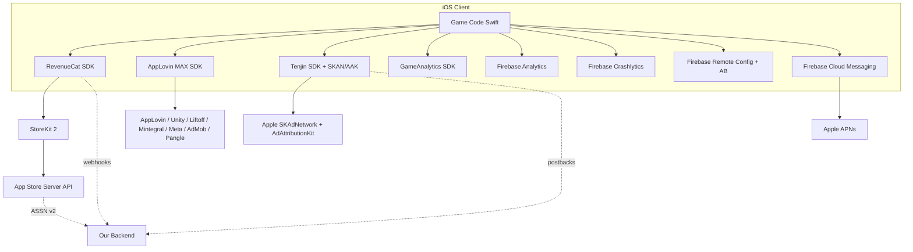

# iOS Monetization SDK Stack — Research

> Target: an iOS-only, Archero-style F2P mobile game. Monetization via IAP (gems, packs, battle pass, subscriptions) and rewarded video ads. Research current as of May 2026.

This document surveys the SDK landscape for a launching F2P iOS title, picks a recommended minimal stack, and notes Apple-specific compliance gotchas.

---

## 1. IAP Layer

The IAP layer is the single most load-bearing piece of the stack: it touches Apple's billing, your server-side entitlement state, and your analytics. Get it wrong and you either lose revenue (bad receipt validation, unrecoverable purchases) or burn engineering cycles re-platforming later.

### 1.1 StoreKit 2 (Apple native)

StoreKit 2 is the modern Swift-first replacement for StoreKit 1 (introduced WWDC21, matured through WWDC23/24). Key facts:

- **Swift-native, async/await API.** Drops the Objective-C `SKPaymentQueue` model. `Product.products(for:)`, `product.purchase()`, and `Transaction.currentEntitlements` are the core primitives.
- **JWS-signed transactions.** Every transaction is a signed JWS payload that your server can cryptographically verify locally, no round-trip to Apple required for basic validation. Replaces the old base64 `appStoreReceiptURL` blob.
- **App Store Server API + Server Notifications V2.** Server-side: use `GET /inApps/v1/transactions/{id}`, `GET /inApps/v1/subscriptions/{originalTransactionId}`, and webhook ASSN V2 events (`DID_RENEW`, `DID_FAIL_TO_RENEW`, `REFUND`, `EXPIRED`, etc.) to drive your entitlement DB.
- **Promotional offers / introductory offers / win-back offers** all first-class. Offer codes can be redeemed via `Transaction.beginRefundRequest` or `AppStore.presentOfferCodeRedeemSheet`.
- **Subscription status groups, family sharing, and StoreKit Testing in Xcode** (local `.storekit` config files for offline testing) are built in.
- **Minimum iOS 15.** Not an issue for a 2026 launch.

**Cost:** Free. Apple takes its standard 30 percent (15 percent under the Small Business Program / for year-2+ subscriptions).

### 1.2 RevenueCat

RevenueCat is the dominant third-party IAP abstraction layer. It wraps StoreKit (and Google Play Billing) and adds:

- **Entitlements model.** You define entitlements like `premium`, `battle_pass_s3`, and map them to products. Client just asks "does this user have `premium`?"
- **Cross-device, cross-platform subscriber state.** Login on iPad, get the same entitlement on iPhone. Important even for iOS-only if you go iPad universal.
- **Subscription charts, cohorts, churn, MRR, trial conversion** out of the box. Replaces a meaningful chunk of "subscription analytics" you'd otherwise build.
- **Server-side webhooks** for purchases, renewals, cancellations, refunds. Single integration point instead of ASSN V2 + Google RTDN.
- **Paywall builder + remote paywall A/B testing** (Paywalls v2, increasingly the differentiator vs. plain SDKs).
- **Customer Center** — drop-in subscription management UI.

**Pricing (2026):** Free up to $2.5K monthly tracked revenue (MTR). Above that, 1 percent of tracked revenue on the Starter plan. Pro/Enterprise tiers add Experiments, Targeting, and audience exports. ([RevenueCat pricing](https://checkthat.ai/brands/revenuecat/pricing))

### 1.3 Adapty / Qonversion / Superwall

- **Adapty** — closest peer to RevenueCat. Stronger paywall A/B testing and AI-driven paywall iteration. Free up to $5K MTR, 1 percent above. ([RevenueCat alternatives](https://sph.sh/en/posts/revenuecat-alternatives-comparison-2026/))
- **Qonversion** — cheapest at scale: free up to $10K MTR, 0.6 percent above. No-code paywall builder, Apple Search Ads integration, refund recovery.
- **Superwall** — paywall-first; pairs well with RevenueCat (paywall) + RC (entitlements).

### 1.4 IAP Recommendation

**Use RevenueCat.** Rationale:

1. We have a small team and limited backend bandwidth at launch. The first 12 months of MTR will be well under $2.5K MTR (free tier).
2. 1 percent above $2.5K MTR is cheaper than building, staffing, and operating an entitlement service. We'd cross over to "build it ourselves" only past roughly $100K MTR.
3. Battle pass and gem packs are non-consumable / consumable products that don't strictly *need* RC's entitlement abstraction — but the subscription tier (VIP / battle pass premium) does, and we want one IAP path for everything.
4. Paywall A/B testing without an app release is a meaningful revenue lever for an F2P launch.
5. RC sits *on top* of StoreKit 2; we're never locked in. Migration to pure StoreKit 2 later is a backend swap, not a re-architecture.

Reconsider Adapty if paywall experimentation becomes the bottleneck; reconsider pure StoreKit 2 only past ~$100K MTR.

---

## 2. Ad Mediation

Rewarded video is the second revenue pillar for an Archero-style game (free spins, free chests, double-rewards, energy refills). Mediation routes each ad request to whichever network bids highest in real time.

### 2.1 The big three mediation platforms

| Platform | Strengths | Weaknesses | iOS notes (2026) |
|---|---|---|---|
| **AppLovin MAX** | Highest blended eCPM in most published benchmarks; deepest in-app bidding; strongest hyper-casual / casual-game DNA | Locks you into AppLovin's broader stack (AppDiscovery, Array); UI heavy | Currently #1 SDK rank on Apple App Store per Pixalate Q3 2025 |
| **Unity LevelPlay** (ex-ironSource) | Strong for Unity-built games, integrated with Unity Ads and Tapjoy; good UA + monetization loop | Lost share to MAX in 2025; slower ROI ramp | Solid alternative if our engine is Unity |
| **Google AdMob** | Easy onboarding, high fill in T2/T3 markets, native Firebase integration | Lower eCPM ceiling for rewarded video in T1 | Best as a *mediated network*, not the mediation layer itself |

Rewarded video eCPM in Tier 1 (US/UK/JP/DE) typically lands $15–$30 in 2026; MAX and LevelPlay deliver the top blended numbers via real-time bidding across 25+ networks. ([MAX vs LevelPlay 2025](https://www.globalgamesforum.com/news/max-vs-levelplay-9-facts-about-the-mediation-space-in-2025))

### 2.2 Networks to add as demand sources

Once mediation is in place, plug in:

- **AppLovin** (native, always-on)
- **Unity Ads** (high fill on gaming inventory)
- **Liftoff / Vungle** — Vungle SDK 7.7+ (Jan 2026) added native video, strong on rewarded
- **Mintegral** — top-3 globally in AppsFlyer Performance Index 17; Target-ROAS bidding
- **Meta Audience Network** — returned to iOS in 2025 after a pause; useful T1 demand
- **Google AdMob** (as a network, even if MAX is mediator)
- **Pangle** (ByteDance) — competitive for casual games

### 2.3 Ad Recommendation

**AppLovin MAX as mediator, with AppLovin + Unity Ads + Liftoff + Mintegral + Meta + AdMob + Pangle as demand sources.**

Start with five networks; add more once we have stable ad ARPDAU benchmarks. Use MAX's A/B testing (waterfall + bidding) once we have ≥10K DAU.

**Cost:** Free. Networks revenue-share (you keep ~70–80 percent of advertiser spend, varies by network).

---

## 3. Attribution & MMP (post-ATT)

This is the messiest layer in 2026. ATT killed deterministic IDFA-based attribution for ~65 percent of users (global ATT opt-in is ~35 percent per Adjust Q2 2025). The replacement is a *layered* model.

### 3.1 The iOS attribution stack today

1. **SKAdNetwork (SKAN) 4** — Apple's privacy-preserving framework. The App Store sends time-delayed, aggregated postbacks to ad networks. SKAN 4 supports hierarchical conversion values (coarse / fine) and three postback windows (0–2d, 3–7d, 8–35d).
2. **AdAttributionKit (AAK)** — Apple's successor framework, no announced SKAN deprecation. Dual-integrate now.
3. **ATT-gated IDFA** — for the ~35 percent who opt in, traditional deterministic attribution still works.
4. **Probabilistic / fingerprint** — directional only; many MMPs offer it but it's a grey zone vs. Apple's policy.
5. **Self-attributing networks (SANs)** — Meta, Google, TikTok report installs directly.

Volume note: SKAN needs ~100–150 installs per campaign per day to escape Apple's privacy thresholds (otherwise you get null conversion values). Plan UA budgets accordingly. ([SKAN best practices 2026](https://www.aarki.com/insights/ios-attribution-in-2026-5-things-marketers-need-to-know/))

### 3.2 MMP options

| MMP | Best for | Pricing |
|---|---|---|
| **AppsFlyer** | Largest network coverage, biggest integration ecosystem; the safe default | Free Zero plan (limited), then volume-based |
| **Adjust** | Strong fraud (Fraud Prevention Suite); good EU compliance posture | Custom enterprise pricing |
| **Singular** | Best ETL / cost aggregation (ad spend ↔ revenue) for marketing finance | Standard / Premium / Enterprise tiers |
| **Tenjin** | Game-focused, transparent pricing — $200 for 10K conversions; **2K conversions/month free** | Pay-as-you-go available |
| **Branch** | Deep linking primary, attribution secondary | Free tier |

### 3.3 Attribution recommendation

**Launch on Tenjin** (free 2K conversions covers soft launch), upgrade to **AppsFlyer** once we're spending >$10K/month on UA. Tenjin is built for indie/mid-tier game studios and is cheaper than AppsFlyer until paid UA scales.

Integrate **SKAN 4 + AAK in dual mode** through whichever MMP we pick — both pass through the postback. Don't waste time building SKAN-native; the MMPs aggregate this for us.

---

## 4. Analytics

Two layers are needed: (a) lightweight game-event analytics for product/design loops, (b) revenue analytics (covered partly by RevenueCat).

| Tool | Pros | Cons | Cost |
|---|---|---|---|
| **GameAnalytics** | Free up to 2M MAU; game-specific (progression events, design events, ad ARPDAU, GameIntel benchmarks) | Less flexible than Amplitude; no SQL access | Free → $299/mo Pro |
| **Firebase Analytics** | Free, native GA4 integration, BigQuery export, ties into Crashlytics + Remote Config + ABT | Event schema is generic, not game-specific | Free (BigQuery export costs separate) |
| **Amplitude** | Best behavioral analysis, funnels, retention cohorts, SQL access | Pricier at scale; overkill for early launch | Free up to 10M events/mo, then custom |
| **Mixpanel** | Similar to Amplitude, slightly cheaper at low volume | Less mobile-game-specific than GA | Free up to 1M events/mo |
| **Tenjin** | Doubles as MMP + ad LTV / cohort analytics | Less product-analytics depth | Bundled with MMP plan |

### Analytics recommendation

**Run GameAnalytics + Firebase Analytics in parallel.**

- GameAnalytics for game-design dashboards (progression funnels, design events, ad ARPDAU vs. industry benchmark).
- Firebase Analytics as the system-of-record for events that need to feed BigQuery, Remote Config audiences, or downstream warehousing.

Both are free at our launch scale. Revisit Amplitude only if Product/Design hits the GameAnalytics ceiling, typically post-100K DAU.

---

## 5. Crash Reporting

| Tool | Pros | Cons | Cost |
|---|---|---|---|
| **Firebase Crashlytics** | Free; tight Firebase integration; iOS-first; trivial to add | Mobile-only; less rich error context than Sentry | Free |
| **Sentry** | Cross-platform (incl. backend); better error context, breadcrumbs, performance, release health, source maps | Paid past free quota; more setup | Free tier (5K errors/mo) → paid from $26/mo |

### Crash recommendation

**Firebase Crashlytics** at launch. If we add a backend with significant logic (live ops API, custom analytics pipelines, etc.), add **Sentry** for the *server* side, keep Crashlytics for the *client*. Don't pay for both on mobile.

---

## 6. A/B Testing & Remote Config

Critical for an F2P game: tuning drop rates, pricing, paywall timing, onboarding, tutorials. Live ops without re-releasing the app is non-negotiable.

| Tool | Pros | Cons | Cost |
|---|---|---|---|
| **Firebase Remote Config + A/B Testing** | Free; native to mobile; Audiences feature ties to Analytics; works offline (config is cached) | Statistical engine is basic; UI dated | Free |
| **Statsig** | Strong stats engine (CUPED, sequential testing); warehouse-native; faster reads | Pricier; more setup | Free up to 1M events/mo, then usage-based |
| **GrowthBook** | Open-source, SQL/warehouse-native, can self-host | Engineering overhead for self-host | Free Starter (3 seats), $20/user/mo Pro |
| **Native config server** | Full control, custom JSON schemas | Build + ops cost; rolling targeting yourself | Engineering time |

### Remote config recommendation

**Firebase Remote Config + A/B Testing.** It's free, mobile-native, and we'll already be using Firebase for Analytics + Crashlytics. Tie experiments to Firebase Audiences so we can target by country, retention bucket, or LTV cohort.

Critical hygiene: keep an `experiments` JSON blob in Remote Config that the client treats as schema-validated. Don't sprinkle one Remote Config key per knob; group them so we can ship coordinated changes.

---

## 7. Push Notifications

| Tool | Pros | Cons | Cost |
|---|---|---|---|
| **Apple Push Notification service (APNs)** | Free, native, direct — lowest latency | No segmentation, A/B testing, or campaign UI yourself | Free |
| **Firebase Cloud Messaging (FCM)** | Free unlimited; wraps APNs on iOS; ties to Audiences | One extra hop (FCM → APNs); slightly higher latency; no campaign UI | Free |
| **OneSignal** | Best campaign UI, segmentation, A/B testing out of the box | Free tier limits past 10K subscribers; Growth tier ~$0.012/MAU for mobile push | Free up to certain MAU, then ~$600/mo at 50K MAU |

### Push recommendation

**FCM via Firebase**, with our own server-side scheduler keyed off Firebase Audiences and player-state events. We get unlimited free push, native Firebase Audience targeting, and no per-MAU bill. Migrate to OneSignal only if growth/marketing demands a no-code campaign UI.

---

## 8. Apple-Specific Compliance

### 8.1 App Tracking Transparency (ATT)

ATT prompt design moves opt-in rates by 20–40 percentage points. Best-practice pattern:

1. **Pre-prompt screen** *before* Apple's system ATT dialog. Full-screen, branded, benefit-focused headline (under 10 words), 1–2 sentence body explaining the value exchange. One CTA button that triggers `ATTrackingManager.requestTrackingAuthorization`.
2. **Timing.** Trigger after the first satisfying gameplay moment (first boss kill, first chest opening), not on cold launch. Users opt in more readily once they're invested.
3. **Copy hygiene.** Avoid "IDFA," "advertising identifier," or technical jargon. Frame as *"help us bring you free new content and better rewards"*.
4. **What you can't do.** Apple's policy forbids: (a) re-prompting if the user denies, (b) gating app functionality on opting in, (c) offering rewards for opting in, (d) dark-patterned dialogs.

Apps with thoughtful pre-prompts hit ~65 percent opt-in vs. ~35 percent global baseline. ([ATT opt-in rates 2025](https://www.purchasely.com/blog/att-opt-in-rates-in-2025-and-how-to-increase-them))

### 8.2 App Store Review Guideline 3.1.1 — loot box odds disclosure

Apps that sell randomized virtual items (gacha chests, mystery boxes, lucky wheels) **must disclose the odds of receiving each item type before the customer purchases**.

Implications for our Archero-style design:

- Lucky wheel spins, gem chests, and any "mystery pack" need an in-game odds-disclosure screen that's reachable from the purchase flow.
- Disclosure must list each tier of outcome and the probability. We typically present this as a tap-through "Drop rates" button on the purchase confirmation sheet.
- Keep the odds table in Remote Config so we can change drop rates and the disclosure together (they must always match — divergence is a reviewer-rejection vector).
- Some jurisdictions (China, South Korea, Belgium implications) have stricter rules. China requires individual-item odds, not just rarity-tier odds.

### 8.3 StoreKit configuration & sandbox

- **Sandbox testers** are managed in App Store Connect → Users and Access → Sandbox. Each tester needs a unique Apple ID. Subscriptions in sandbox renew on accelerated cycles (a 1-month sub renews every 5 minutes for the first 6 cycles).
- **`.storekit` config files** in Xcode let you simulate purchases entirely offline, including failure modes (`AskToBuy`, declined cards, expired subs, refunds). Use these for unit + UI tests.
- **Server-Sandbox vs. Server-Production** App Store Server API endpoints are different. Make sure your env-routing handles TestFlight builds.

### 8.4 Apple Search Ads (ASA) as a UA channel

- Median ASA CPI for **games** is ~$12.28 (much higher than the all-app median of $1.80 because games is a competitive vertical). US is the most expensive market.
- ASA delivers ~15–20 percent higher D1 retention than other paid sources because users are high-intent (they searched for the app).
- **March 2026:** Apple expanded search results ads from 1 slot to up to 5. More inventory, more competition, but also more ways to burn budget; structure campaigns by intent (brand, competitor, category, discovery).
- ASA Basic is auto-managed (set a CPI cap and let Apple run it); ASA Advanced gives keyword-level control. Start Basic, graduate to Advanced once we see >$5K/month spend.

---

## 9. Recommended Minimal Stack at Launch

The smallest viable set of SDKs to ship a monetizable iOS F2P game:

1. **RevenueCat** — IAP + entitlements + subscription analytics + paywall A/B
2. **AppLovin MAX** — ad mediation, with AppLovin / Unity / Liftoff / Mintegral / Meta / AdMob / Pangle as demand sources
3. **Tenjin** — MMP / SKAN postbacks (graduate to AppsFlyer at scale)
4. **GameAnalytics** + **Firebase Analytics** — product analytics, game-design loops
5. **Firebase Crashlytics** — crash reporting
6. **Firebase Remote Config + A/B Testing** — live ops, config-driven balance, experiments
7. **Firebase Cloud Messaging** — push

That's 7 SDKs (Firebase is one umbrella). Estimated client-side binary footprint: ~15–25 MB compiled in. Integration time for a competent iOS engineer: ~3–4 weeks for first integration, ~1 week to validate the full purchase + ad flow end-to-end in TestFlight.

---

## 10. Stack Recommendation Diagram

**Stack at a glance:**

- **IAP:** RevenueCat (on StoreKit 2)
- **Ads:** AppLovin MAX
- **Attribution:** Tenjin → AppsFlyer at scale (SKAN 4 + AAK)
- **Analytics:** GameAnalytics + Firebase Analytics
- **Crashes:** Firebase Crashlytics
- **Remote config / A/B:** Firebase Remote Config + A/B Testing
- **Push:** Firebase Cloud Messaging

---

## 11. Monthly Cost Estimates

### At launch (0–10K DAU, <$2.5K MTR, soft launch UA budget ~$5K/mo)

| Line item | Cost |
|---|---|
| RevenueCat | $0 (under free MTR cap) |
| AppLovin MAX + networks | $0 (rev-share, no SDK fee) |
| Tenjin | $0 (under 2K conversions/mo free) |
| GameAnalytics | $0 (under 2M MAU) |
| Firebase (Analytics + Crashlytics + Remote Config + FCM) | $0 (Spark plan) |
| Apple Developer Program | $99/yr ≈ $8/mo |
| **Total SDK cost** | **~$8/mo** |
| Apple Search Ads (optional) | $1,000–5,000/mo |
| Other paid UA | variable |

### At scale (250K DAU, ~$150K MTR, $50K/mo UA)

| Line item | Cost |
|---|---|
| RevenueCat (1% of MTR above $2.5K) | ~$1,475/mo |
| AppLovin MAX + networks | $0 (rev-share) |
| AppsFlyer (replaces Tenjin) | ~$1,500–3,000/mo (volume-tiered) |
| GameAnalytics Pro (if needed) | $299/mo |
| Firebase Blaze (events + BigQuery export + FCM) | ~$200–500/mo |
| Sentry (optional, server-side) | $26–80/mo |
| **Total SDK cost** | **~$3,500–5,500/mo** (≈ 2–4% of MTR) |
| Apple Search Ads | $10,000–30,000/mo |
| Other paid UA | $20,000–40,000/mo |

The SDK/tools layer stays well under 5 percent of revenue, which is the rule-of-thumb threshold for "stop optimizing tooling, ship more content." If we cross that line, the next optimization is moving off RevenueCat onto pure StoreKit 2.

---

## Sources

- [App Review Guidelines — Apple Developer](https://developer.apple.com/app-store/review/guidelines/)
- [Meet StoreKit 2 — WWDC21](https://developer.apple.com/videos/play/wwdc2021/10114/)
- [What's new in StoreKit 2 — WWDC23](https://developer.apple.com/videos/play/wwdc2023/10140/)
- [Validating receipts with the App Store — Apple Developer Documentation](https://developer.apple.com/documentation/storekit/validating-receipts-with-the-app-store)
- [StoreKit 2 vs RevenueCat 2026 — The Swift Kit](https://theswiftk.it.com/blog/storekit-2-vs-revenuecat-ios-subscriptions)
- [RevenueCat Alternatives 2026 — sph.sh](https://sph.sh/en/posts/revenuecat-alternatives-comparison-2026/)
- [RevenueCat Pricing 2026 — CheckThat.ai](https://checkthat.ai/brands/revenuecat/pricing)
- [Unity LevelPlay vs AppLovin MAX 2025 — bidlogic](https://bidlogic.io/2025/08/29/unity-levelplay-vs-applovin-max-2025-how-to-choose-the-best-ad-mediation-platform/)
- [MAX vs LevelPlay 2025 — Gamesforum](https://www.globalgamesforum.com/news/max-vs-levelplay-9-facts-about-the-mediation-space-in-2025)
- [Pixalate Q3 2025 Ad SDK Market Share](https://www.globenewswire.com/news-release/2025/11/06/3183253/0/en/Pixalate-s-Global-Q3-2025-Ad-SDK-Market-Share-Rankings-Meta-Audience-Network-87-Leads-Among-Google-Play-Store-Apps-AppLovin-85-No-1-on-Apple-App-Store-Apps.html)
- [iOS Attribution in 2026 — Aarki](https://www.aarki.com/insights/ios-attribution-in-2026-5-things-marketers-need-to-know/)
- [SKAdNetwork SKAN 2026 — RocketShip HQ](https://www.rocketshiphq.com/what-is-skadnetwork-skan-how-it-works/)
- [Top MMPs 2026 — Business of Apps](https://www.businessofapps.com/marketplace/app-analytics/mobile-measurement-partners/)
- [Tenjin MMP](https://tenjin.com/mmp/)
- [GameAnalytics Pricing 2026 — G2](https://www.g2.com/products/gameanalytics/pricing)
- [Sentry vs Crashlytics — Sentry](https://sentry.io/resources/sentry-vs-crashlytics-mobile-developers-guide/)
- [Firebase Remote Config A/B Testing — Firebase Docs](https://firebase.google.com/docs/ab-testing/abtest-config)
- [Apple Loot Box Odds Disclosure — Fenwick](https://www.fenwick.com/insights/publications/apple-now-requires-disclosure-of-loot-box-odds)
- [ATT Opt-In Rates 2026 — Business of Apps](https://www.businessofapps.com/data/att-opt-in-rates/)
- [ATT Opt-In Best Practices — Purchasely](https://www.purchasely.com/blog/att-opt-in-rates-in-2025-and-how-to-increase-them)
- [Apple Search Ads Costs 2026 — Business of Apps](https://www.businessofapps.com/marketplace/apple-search-ads/research/apple-search-ads-costs/)
- [Firebase Cloud Messaging vs OneSignal 2026 — Ably](https://ably.com/compare/fcm-vs-onesignal)
- [Archero Monetization Strategy — Udonis](https://www.blog.udonis.co/mobile-marketing/mobile-games/archero-monetization)
